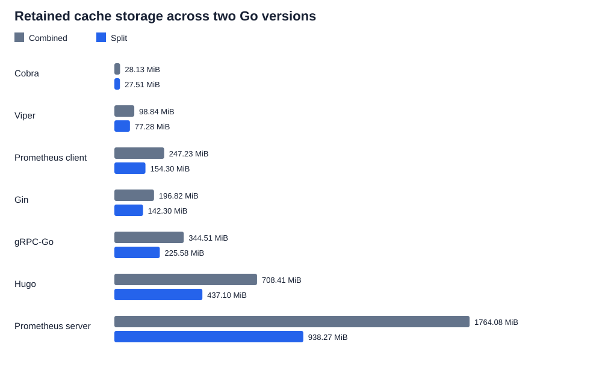
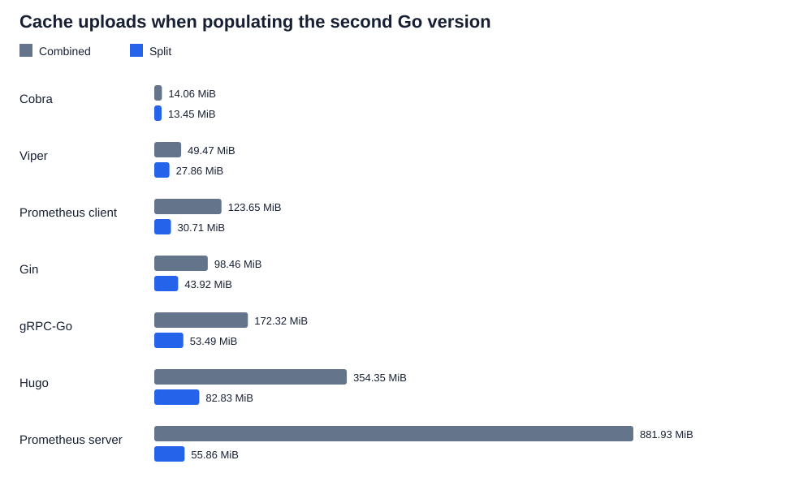
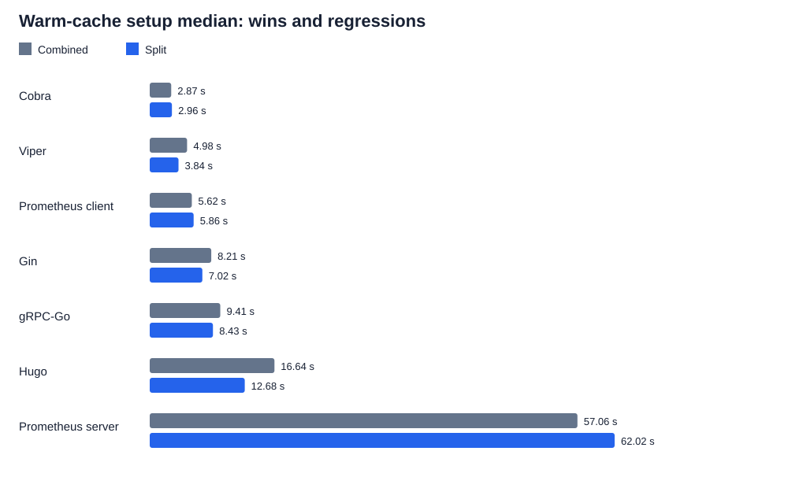

# setup-go: split-cache performance and adoption case

**Benchmark date:** October 5, 2026  
**Project-workflow review and report:** October 6, 2026  
**Candidate:** [actions/setup-go PR #797](https://github.com/actions/setup-go/pull/797), immutable commit [`ad9941188fbcb38febe37eac394b80bd9bc34fc8`](https://github.com/actions/setup-go/commit/ad9941188fbcb38febe37eac394b80bd9bc34fc8)  
**Baseline:** combined-cache implementation at [`90ad2b35f69faf97585ad74d28fa006d2739b7af`](https://github.com/actions/setup-go/commit/90ad2b35f69faf97585ad74d28fa006d2739b7af)  
**Scope:** real hosted Windows builds; independent module/build entries; no cross-OS sharing

## Executive summary

Separating downloaded Go modules from compiled build outputs mainly reduces repeated cache writes and retained storage when a workflow changes Go versions or maintains a same-OS version matrix. Parallel restoration can improve latency, but the measurements do not show a universal CI speedup.

Seven widely used Go projects supplied pinned real source workloads. Across their two measured toolchains, retained cache storage fell from **3,388.02 MiB to 2,002.33 MiB: 40.9% less**. Populating the second toolchain uploaded **308.11 MiB rather than 1,694.25 MiB: 81.8% fewer bytes**. These are actual compressed cache-service records, not extrapolated disk sizes. The aggregate is dominated by Hugo and Prometheus; it is not an ecosystem-wide expected percentage.

The strongest adoption cases identified from actual CI are:

1. **Hugo:** explicit Go 1.25/1.26 matrix on Windows and Linux with setup-go caching enabled. Its measured Windows workload retained **271.32 MiB less storage** across two toolchains and restored warm caches **3.96 seconds faster** at the median.
2. **Prometheus client:** stable/oldstable matrices, including Windows and Linux ARM64. Its measured two-toolchain storage decreased **37.6%**, and second-toolchain uploads decreased **75.2%**, although full-hit warm setup was **0.24 seconds slower**.
3. **Viper:** three Go releases on each of Windows, Linux, and macOS. Its measured two-toolchain storage decreased **21.8%**, and warm setup was **1.14 seconds faster**. A same-size three-variant storage model implies **29.1% less storage**, explicitly a projection rather than a reproduced three-version matrix.
4. **gRPC-Go:** latest/previous Go versions and native Linux ARM64 jobs provide genuine same-OS reuse opportunities. The Windows workload showed **69.0% fewer second-version upload bytes**, but Linux latency and architecture reuse were not measured.

The latency differences above are observed sample medians, not independently replicated causal estimates. Prometheus client's write savings coexist with a full-hit restore regression; the practical trade-off depends on how often new toolchain keys are populated versus existing entries restored.

Prometheus server is the largest measured storage beneficiary, but its upstream Linux jobs use a custom container setup and its Windows job uses one Go version. It is a strong **toolchain-upgrade** case, not proof that upgrading setup-go deduplicates its container matrix. Gin already shares a custom combined cache across Go versions, and Cobra has a very small module archive; both are useful controls rather than headline recommendations.

## What changed

The baseline uses one archive keyed by runner OS, runner architecture, Linux image, Go version, and dependency-file hash. The candidate separates it into:

- **Modules:** `setup-go-modules-${RUNNER_OS}-${dependencyHash}`.
- **Build outputs:** `setup-go-build-${RUNNER_OS}-${process.arch}-${ImageOS if Linux}go-${resolvedGoVersion}-${dependencyHash}`.

The module entry can therefore survive a Go-version, runner-architecture, or Linux-image change **within one OS**, provided its path-derived cache version, compression, dependency hash, and cache access scope remain compatible. Exact hits skip their saves independently. Disjoint restores and saves run concurrently where safe; one entry failing does not prevent processing the other.

This report evaluates the committed split, not the subsequently abandoned cross-OS prototype. It does not introduce module relocation, gzip-only workers, separate invalidation inputs, automatic GOOS/GOARCH target keys, or Docker/BuildKit caching. Both implementations already use `@actions/cache` 6.3.0, so the comparison does not mix the toolkit upgrade into the result.

## Project selection: importance and actual CI fit

The sample spans CLI/configuration libraries, HTTP/RPC libraries, monitoring, and a static-site generator. Importance is based on their role and real CI use, not an assumption that popularity or a large dependency count guarantees a speedup. All workflow links below point to the exact source revision used for that project's benchmark.

| Project | Pinned release | Declared requirements | Verified upstream CI pattern | Applicability |
| --- | --- | ---: | --- | --- |
| [Hugo](https://github.com/gohugoio/hugo) | [v0.159.0](https://github.com/gohugoio/hugo/tree/2ed7d193cfdfcf11808fb2a921a9429423b0ebe9) | 184 | [Go 1.25.x/1.26.x on Ubuntu and Windows; cache enabled; dependency hash includes module definitions/checksums](https://github.com/gohugoio/hugo/blob/2ed7d193cfdfcf11808fb2a921a9429423b0ebe9/.github/workflows/test.yml#L15-L44) | Direct same-OS matrix and patch-upgrade beneficiary; best combined storage/latency case in this sample. |
| [Prometheus client](https://github.com/prometheus/client_golang) | [v1.24.1](https://github.com/prometheus/client_golang/tree/d6087ee482e06716ee21dc03819432d5d40f72db) | 23 | [Stable/oldstable definitions](https://github.com/prometheus/client_golang/blob/d6087ee482e06716ee21dc03819432d5d40f72db/supported_go_versions.json); [Windows matrix](https://github.com/prometheus/client_golang/blob/d6087ee482e06716ee21dc03819432d5d40f72db/.github/workflows/test.yml#L123-L146); [Linux ARM64 matrix](https://github.com/prometheus/client_golang/blob/d6087ee482e06716ee21dc03819432d5d40f72db/.github/workflows/test.yml#L63-L86) | Direct two-release reuse on each OS; Linux architecture reuse is conditional on identical cache path/version. |
| [Viper](https://github.com/spf13/viper) | [v1.21.0](https://github.com/spf13/viper/tree/394040caccbdf5821fa6839386a35f0fb1b1ee9e) | 17 | [Go 1.23/1.24/1.25 × Ubuntu/macOS/Windows × three build-tag settings](https://github.com/spf13/viper/blob/394040caccbdf5821fa6839386a35f0fb1b1ee9e/.github/workflows/ci.yaml#L37-L60) | Direct three-release reuse on each OS. Tags are not distinct automatic keys, so nine Windows jobs do not imply nine independent module archives. |
| [gRPC-Go](https://github.com/grpc/grpc-go) | [v1.84.0](https://github.com/grpc/grpc-go/tree/e84aa5ab15d1d2b29d54f838312ad490cb7551a8) | 43 | [Go 1.25/1.26, race/386 variants and native Linux ARM64](https://github.com/grpc/grpc-go/blob/e84aa5ab15d1d2b29d54f838312ad490cb7551a8/.github/workflows/testing.yml#L39-L98) | Genuine Linux version/architecture beneficiary; Windows benchmark is a workload proxy, not reproduction of its upstream CI. Cross-target GOARCH on one host does not automatically partition build keys. |
| [Prometheus server](https://github.com/prometheus/prometheus) | [v3.15.0](https://github.com/prometheus/prometheus/tree/5241a27fe3c6983549fccc32f6e65917408c63cd) | 251 | [Single Go 1.27.x Windows setup-go job](https://github.com/prometheus/prometheus/blob/5241a27fe3c6983549fccc32f6e65917408c63cd/.github/workflows/ci.yml#L179-L191); [previous-Go Linux container using promci-setup](https://github.com/prometheus/prometheus/blob/5241a27fe3c6983549fccc32f6e65917408c63cd/.github/workflows/ci.yml#L102-L139) | Strong same-OS upgrade/write-volume case. The custom Linux/container matrix is not automatically covered by this action change. |
| [Gin](https://github.com/gin-gonic/gin) | [v1.12.0](https://github.com/gin-gonic/gin/tree/73726dc606796a025971fe451f0aa6f1b9b847f6) | 35 | [Go 1.25/1.26 on Ubuntu/macOS; setup-go cache disabled](https://github.com/gin-gonic/gin/blob/73726dc606796a025971fe451f0aa6f1b9b847f6/.github/workflows/gin.yml#L31-L61); [custom combined cache omits Go version](https://github.com/gin-gonic/gin/blob/73726dc606796a025971fe451f0aa6f1b9b847f6/.github/workflows/gin.yml#L68-L77) | Requires an intentional workflow migration. Existing custom keys already reuse modules across Go versions; measured baseline is not its current cache strategy. |
| [Cobra](https://github.com/spf13/cobra) | [v1.10.2](https://github.com/spf13/cobra/tree/88b30ab89da2d0d0abb153818746c5a2d30eccec) | 4 | [Eight Go minor releases on Ubuntu/macOS with caching](https://github.com/spf13/cobra/blob/88b30ab89da2d0d0abb153818746c5a2d30eccec/.github/workflows/test.yml#L56-L81); Windows uses a separate MSYS2 path | Relevant matrix, but only a 0.64 MiB module archive in the measured workload. Small absolute gains. |

The counts are all declared requirement directives, including indirect entries, not direct dependency counts or downloaded-module counts. Resolved graph sizes are 6/26/42/56/86/435/746 non-main modules in table order Cobra/Viper/client/Gin/gRPC/Hugo/Prometheus; Go's graph pruning means those are not all downloaded source archives.

### Additional prominent projects: do not overstate fit

[Caddy's reviewed CI](https://github.com/caddyserver/caddy/blob/700d60327d77d56ba81455acb989a698f1819640/.github/workflows/ci.yml) has one Go 1.26 matrix entry across three OSes, with `check-latest` enabled. It is a plausible future patch-upgrade beneficiary, but a three-OS matrix alone does not share modules under this PR, and no Caddy workload was measured. Similarly, a project using only one unchanged Go version and one runner configuration is not a matrix-deduplication case. We do not claim benefits for Kubernetes, Terraform, or GitHub CLI without reproducing their applicable cache/workflow strategy.

## Methodology

### Real hosted build workloads

The existing accepted dataset contains **42 successful jobs and 168 build-only samples** from three workflow executions. This report adds analysis and pinned upstream-workflow evidence; it does not present these as newly rerun benchmarks.

| Phase | Go version | Jobs | Samples | Cache state |
| --- | --- | ---: | ---: | --- |
| [Seed](https://github.com/qmuntal/setup-go-cache-bench-20261005/actions/runs/37318273231) | 1.26.7 | 14 | 14 | Modules and build outputs both miss and are saved. |
| [Warm](https://github.com/qmuntal/setup-go-cache-bench-20261005/actions/runs/37319456778) | 1.26.7 | 14 | 140 | Ten exact-hit samples per project/variant, with local caches cleared each time. |
| [Upgrade](https://github.com/qmuntal/setup-go-cache-bench-20261005/actions/runs/37322876950) | 1.26.8 | 14 | 14 | Combined entry misses; split modules hit and build outputs miss. |

All measured jobs used `windows-latest`, four logical CPUs, runner image `20260925.250.1`, `CGO_ENABLED=0`, and `GOTOOLCHAIN=local`. Toolchain installation occurred before the measured action, avoiding download/install variance in the setup metric. Sources and dependency definitions were identical between variants. Cache locations were explicitly isolated under runner temporary storage; cache versions kept the earlier cancelled test pilot separate. No tests, race builds, replay harnesses, deployments, or E2E workloads ran in the accepted dataset.

Each workload ran `go mod download` followed by `go build`. Cobra, Viper, and Gin built `./...`; Prometheus client built `./prometheus/...`; gRPC built codes/metadata/status and credentials/encoding/resolver/balancer subtrees; Hugo built common/parser plus string/math template packages; Prometheus built model/parser/string utility subtrees. The heavier selections are bounded Windows-compatible builds, **not complete production release builds or upstream test workloads**.

### Metrics and comparison units

- **Warm setup:** real setup-go lookup, download, and extraction, plus small composite/shell-start overhead, measured before the workload. Reported median/mean/range come from ten samples on one VM per variant, not ten independent runner pairs.
- **Upload/storage:** successful compressed byte sizes from cache-service records, matched to saved keys and job creation windows. Two-version retained size means one module entry plus two build entries for split, versus two combined entries for baseline.
- **Post-save:** action archive creation, reservation, upload, and finalization; parsed from precise runner composite end-action duration markers.
- **Upgrade cache/dependency work:** observed setup + explicit module-download + post-save seconds. This excludes compilation and is not a contiguous workflow duration or billable-time estimate.
- **Build time:** recorded for transparency, but one-shot cold/upgrade compilation variation is not attributed to the cache layout.

The Go-version comparison is a **patch upgrade within 1.26**, not a reproduction of stable/oldstable 1.25/1.26. The key-reuse mechanism applies to both; the size and latency of a different release matrix remain unmeasured.

## Measured cache storage and upload gains

| Project | Compressed modules | Combined storage, two versions | Split storage, two versions | Storage saved | Storage reduction | Second-version upload: combined → split | Upload reduction |
| --- | ---: | ---: | ---: | ---: | ---: | ---: | ---: |
| [Cobra](https://github.com/spf13/cobra) | 0.64 MiB | 28.13 MiB | 27.51 MiB | 0.62 MiB | 2.2% | 14.06 → 13.45 MiB | 4.3% |
| [Viper](https://github.com/spf13/viper) | 21.55 MiB | 98.84 MiB | 77.28 MiB | 21.56 MiB | 21.8% | 49.47 → 27.86 MiB | 43.7% |
| [Prometheus client](https://github.com/prometheus/client_golang) | 92.93 MiB | 247.23 MiB | 154.30 MiB | 92.93 MiB | 37.6% | 123.65 → 30.71 MiB | 75.2% |
| [Gin](https://github.com/gin-gonic/gin) | 54.36 MiB | 196.82 MiB | 142.30 MiB | 54.52 MiB | 27.7% | 98.46 → 43.92 MiB | 55.4% |
| [gRPC-Go](https://github.com/grpc/grpc-go) | 118.80 MiB | 344.51 MiB | 225.58 MiB | 118.94 MiB | 34.5% | 172.32 → 53.49 MiB | 69.0% |
| [Hugo](https://github.com/gohugoio/hugo) | 271.66 MiB | 708.41 MiB | 437.10 MiB | 271.32 MiB | 38.3% | 354.35 → 82.83 MiB | 76.6% |
| [Prometheus server](https://github.com/prometheus/prometheus) | 826.51 MiB | 1,764.08 MiB | 938.27 MiB | 825.81 MiB | 46.8% | 881.93 → 55.86 MiB | 93.7% |
| **Total** | **1,386.45 MiB** | **3,388.02 MiB** | **2,002.33 MiB** | **1,385.69 MiB** | **40.9%** | **1,694.25 → 308.11 MiB** | **81.8%** |

Splitting does not materially improve compression when both entries are missing. The summed split archives differed from each project's combined seed archive by less than **0.11% in magnitude**. Savings arise because unchanged modules are stored and uploaded once, not because splitting makes the same contents smaller. Totals exclude benchmark artifacts, obsolete pilot entries, legacy migration entries, and the other design's caches.

## Warm-cache performance: wins and regressions

Ten full-hit samples per project/variant; positive change below means slower. These are within-job descriptive distributions, not independently replicated statistical estimates.

| Project | Combined median | Split median | Change | Combined mean | Split mean | Combined observed range | Split observed range |
| --- | ---: | ---: | ---: | ---: | ---: | ---: | ---: |
| [Cobra](https://github.com/spf13/cobra) | 2.87 s | 2.96 s | +3.2% | 2.80 s | 3.26 s | 2.08–3.16 s | 2.57–6.23 s |
| [Viper](https://github.com/spf13/viper) | 4.98 s | 3.84 s | −22.9% | 5.00 s | 3.85 s | 4.21–5.48 s | 3.47–4.22 s |
| [Prometheus client](https://github.com/prometheus/client_golang) | 5.62 s | 5.86 s | +4.3% | 5.59 s | 5.84 s | 5.13–5.95 s | 5.67–6.00 s |
| [Gin](https://github.com/gin-gonic/gin) | 8.21 s | 7.02 s | −14.5% | 8.39 s | 7.03 s | 7.56–9.99 s | 6.39–7.58 s |
| [gRPC-Go](https://github.com/grpc/grpc-go) | 9.41 s | 8.43 s | −10.4% | 9.40 s | 8.51 s | 8.36–10.92 s | 7.81–10.39 s |
| [Hugo](https://github.com/gohugoio/hugo) | 16.64 s | 12.68 s | −23.8% | 16.83 s | 12.73 s | 15.93–19.15 s | 12.13–14.05 s |
| [Prometheus server](https://github.com/prometheus/prometheus) | 57.06 s | 62.02 s | +8.7% | 57.81 s | 62.41 s | 55.13–66.51 s | 60.20–65.22 s |

Four workloads improved and three regressed. Hugo is the clearest combined storage and warm-latency win in this dataset. Prometheus server is the clearest counterexample to assuming a larger dependency cache always restores faster. Summing the seven medians gives 104.78 versus 102.81 seconds, but that artificial sum is **not measured workflow time or an adoption-scale saving**.

The raw analysis also records nearest-rank p95; with only ten samples it is the maximum observation, so the report uses observed ranges instead of advertising a robust tail-latency conclusion. Pairing sample numbers from different VMs is not a controlled hardware-matched experiment; no independent-run confidence intervals or significance claims are made.

## Toolchain change: where elapsed time is actually saved

On the upgrade, both designs had a cold build cache. The split avoided re-downloading ordinary module sources from their proxy, but had to restore the existing module archive. The relevant comparison is not a fast combined cache miss versus a slower module hit in isolation: it includes module downloads and post-save.

| Project | Setup + module download: combined | Setup + module download: split | Post-save: combined | Post-save: split | Cache/dependency work total: combined → split | Observed difference |
| --- | ---: | ---: | ---: | ---: | ---: | ---: |
| [Cobra](https://github.com/spf13/cobra) | 2.61 s | 2.63 s | 3.13 s | 1.50 s | 5.74 → 4.13 s | −1.61 s |
| [Viper](https://github.com/spf13/viper) | 3.70 s | 3.73 s | 3.27 s | 3.25 s | 6.97 → 6.98 s | +0.01 s |
| [Prometheus client](https://github.com/prometheus/client_golang) | 4.65 s | 4.40 s | 6.92 s | 2.40 s | 11.57 → 6.80 s | −4.77 s |
| [Gin](https://github.com/gin-gonic/gin) | 5.65 s | 8.78 s | 5.10 s | 2.69 s | 10.75 → 11.46 s | +0.72 s |
| [gRPC-Go](https://github.com/grpc/grpc-go) | 8.65 s | 7.19 s | 6.68 s | 2.70 s | 15.32 → 9.89 s | −5.43 s |
| [Hugo](https://github.com/gohugoio/hugo) | 18.24 s | 14.67 s | 16.21 s | 4.30 s | 34.45 → 18.97 s | −15.48 s |
| [Prometheus server](https://github.com/prometheus/prometheus) | 39.77 s | 54.48 s | 26.33 s | 3.87 s | 66.10 → 58.34 s | −7.76 s |

**Each cell in this table comes from only one project/variant job.** These are observations and candidate mechanisms for follow-up, not stable percentages or confidence-backed speedups. In particular:

- Hugo avoided 271.52 MiB of uploads, with post-save observed at 4.30 rather than 16.21 seconds. Its full cache/dependency component was lower by 15.48 seconds.
- Prometheus client avoided 92.95 MiB of uploads and observed a 4.77-second reduction in this component, despite a slight full-hit warm regression.
- Prometheus server's module-hit restore plus download was 14.71 seconds slower than a combined miss plus proxy download. Its post-save was 22.47 seconds lower, leaving a 7.76-second net component reduction. This trade-off must remain visible.
- Gin's slower restore outweighed its cheaper save in this one observation; Viper was effectively unchanged.

Cold/upgrade build times varied substantially between independent VMs. Viper's upgrade compilation was 50.44 seconds baseline versus 25.33 split; Prometheus was 49.39 versus 75.93 seconds. Since both build caches missed, these differences cannot establish a compiler benefit or regression caused by splitting. We therefore do not headline total build/job-duration speedups from the one-shot upgrade data.

## Expected matrix savings

For one compatible OS/cache scope, let M be compressed modules and B_i the compressed build archive for variant i. Approximately:

- Combined storage = N × M + sum(B_i).
- Split storage = M + sum(B_i).
- Avoided duplicate storage = (N − 1) × M.

This predicts retained bytes, not workflow speed. Once the module entry exists, each new build-key variant can also avoid approximately M bytes of module upload. Initial concurrent writers can still compress before reserving the shared key, so the formula is not a cold-compression CPU saving.

### Three-version Viper example — projection

Viper actually tests three Go releases per OS. Using its measured 21.55 MiB module archive and 27.87 MiB seed build archive, three similarly sized build variants imply **148.26 MiB combined versus 105.16 MiB split: 43.11 MiB / 29.1% less** for one compatible OS/cache scope. The benchmark measured two 1.26 patch versions, not the exact 1.23/1.24/1.25 matrix; build sizes and dependency subsets can differ across those releases. Multiplying that result across OSes requires separate per-OS measurements and does not mean the module archive is shared across OSes.

### Linux architectures and image changes — mechanism, not measured gain

Prometheus client and gRPC-Go have native Linux ARM64 jobs alongside x64. Removing architecture and Linux image from the module key permits reuse only if the full module-cache path, compression/version, hash, and accessible scope match. This dataset does not verify that their default hosted paths match, and it contains no Linux or architecture benchmark. It would be incorrect to project the Windows timing results as measured Linux gains.

## Adoption priorities and non-beneficiaries

**Prioritize:** Hugo, Prometheus client, and Viper, because their pinned CI already uses setup-go caching with multiple Go versions on the same OS. Their module archive sizes justify storage/upload benefits independently of a latency promise. gRPC-Go is a good follow-up for a separately authorized native Linux experiment, especially its release/architecture matrix. Prometheus server is a good patch-upgrade case where reducing writes is valuable even if module restoration is expensive.

**Do not count every CI job as another saving:** repeated jobs with the same existing key already share one immutable entry under both designs. Viper's tag variants, gRPC's race/386 builds on the same runner, and source-only commits do not automatically create distinct candidate build keys. Adding sources or target files to the shared `cache-dependency-path` changes both hashes, so it re-duplicates modules across those revisions. Docker builds and custom promci-setup archives are not managed by setup-go simply because the repository also uses setup-go elsewhere.

**Do not claim automatic migration gains for Gin:** its custom cache key already omits Go version and its main matrix explicitly disables setup-go caching. Switching to this PR may improve independent build snapshot management, but that is a different comparison and needs its own benchmark. Cobra can benefit mechanically, but avoiding fractions of a MiB is a weak storage-led adoption case.

## Infrastructure and cost interpretation

The observed improvements translate most directly to fewer immutable duplicate module archives, less upload traffic, and potentially less eviction pressure in a repository's cache quota. They do not constitute global deduplication: caches remain scoped by repository and branch/default-branch access rules, OS, dependency hash, and toolkit archive version.

There is no account usage dataset here, so the report does not multiply these project results by guessed invocation counts. Upload savings recur when a **new build key** is populated while modules are unchanged—not on every exact-hit CI run. Warm jobs uploaded no cache bytes under either design. Reducing elapsed cache work also does not prove lower billed minutes; billing depends on complete job duration, concurrency, rounding boundaries, runner type, and account plan, none of which were isolated as an attributable cost saving.

Cross-OS sharing was investigated separately and abandoned before this report. Linux, Windows, and macOS still retain separate module entries. Ordinary modules may be portable in Go, but this candidate does not implement the archive/path relocation needed to share them across runner OSes.

## Compatibility and operational trade-offs

- New module/build key namespaces do not restore old combined archives: an initial refill is needed, and old/new entries can coexist until eviction.
- Workflows using setup-go directly need no new inputs or tooling from the split itself. Existing cache tooling requirements remain unchanged.
- Manual `actions/cache/restore` consumers need two entries and their new key formulas.
- `cache-hit` is true only if both entries match their primary keys; one exact hit plus one miss reports false, without discarding or re-uploading the hit.
- Two entries add service requests and metadata overhead. Concurrent compression/extraction can increase peak resource use; one small module entry may not justify that overhead.
- Immutable module snapshots can miss dependencies used only by another target/test/toolchain; Go downloads missing files normally, but exact hits cannot merge new contents into the remote entry. Automatic toolchain downloads are platform/version-specific modules; they were disabled in this benchmark.
- Both source-only exact hits and unchanged full-hit jobs still skip saving newly generated build artifacts. This PR does not solve remote snapshot refresh or independent source-versus-dependency invalidation.

## Limitations and next measurements

1. **No independent latency replication:** ten warm repeats ran on one VM for each project/variant. Scheduling/network/filesystem differences between VMs remain uncontrolled. A next experiment should use ten independently dispatched before/after pairs with randomized variant order and report paired medians and uncertainty at the runner-pair level.
2. **Upgrade n=1 per variant:** storage byte counts are real, but upgrade timings need ten independent pairs before advertising a repeatable speedup.
3. **Patch-only transition:** the direct stable/oldstable application is established from workflow/key evidence, not measured between minor releases. Hugo/client/Viper are the best Windows follow-up workloads for actual release-line transitions.
4. **Windows-only:** upstream Linux/macOS/ARM64 timings and cache-version compatibility are unmeasured. No Linux benchmark was run under the user's Windows-only preference.
5. **Build-only bounded workloads:** no tests, test-only dependencies generated by test execution, race builds, full heavy-application releases, or CGO. Default `go mod download` deliberately prefilled declared dependency archives; this can be larger than a production build-only dependency subset.
6. **Custom upstream caches:** Gin and Prometheus containers are applicability controls, not assertions that an action-version update alone changes their cache behavior.
7. **Source/code unchanged:** the candidate remains the committed draft split. Abandoned local prototype changes were removed; report creation does not change the action code or PR state.
8. **No automatic cache deletion:** experiments left their existing cache entries intact. The size figures describe the measured design entries, not current total occupancy or artifact storage. No destructive cleanup was performed.

## Reproducibility

- [Pinned project sources and workload definitions](../projects.json).
- [Hosted workflow](../.github/workflows/benchmark.yml), [sample action](../.github/actions/sample/action.yml), [measurement script](../.scripts/benchmark.ps1), and [collector](../.scripts/collect.mjs).
- [Sanitized raw sample measurements](../benchmark-data/samples.json), [job/cache-upload metadata](../benchmark-data/jobs.json), [phase summaries](../benchmark-data/rows.json), and [persisted cache record snapshot](../benchmark-data/caches.json).
- [Pinned upstream workflow and module-definition evidence](upstream-evidence.json).
- [Computed descriptive statistics](analysis.json), [project CSV](project-results.csv), and [report/chart generator](../.scripts/report.mjs).

The report generator reads committed sanitized measurements instead of depending on retained workflow artifacts or live caches. It retrieves pinned upstream files through authenticated GitHub API access for the CI-fit analysis and generates the CSV/JSON/SVG outputs. Public output excludes raw action logs, signed download/upload URLs, credentials, and tokens.

**Bottom line:** the split is well-supported as a same-OS module-storage/write reduction for real Go-version matrices, especially Hugo, Prometheus client, and Viper. Warm latency improves for some workloads and regresses for others. The existing data supports concrete infrastructure benefits and targeted follow-up experiments—not a universal faster-build or billed-cost claim.
